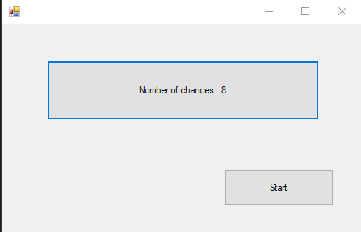
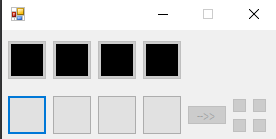
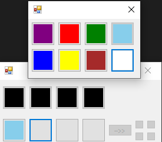
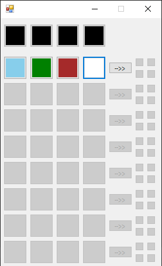
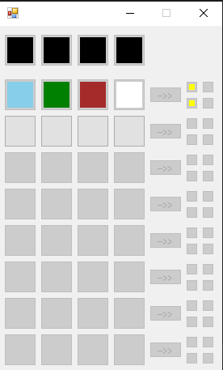
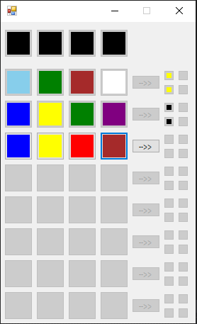
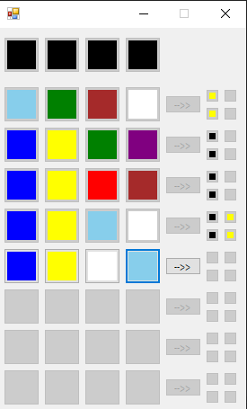
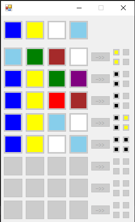

Bulls and Cows
===

# Summary

---

Bulls and Cows is a code-breaking mind,
The game is played in turns by two opponents who aim to decipher the other's secret code by trial and error.

# Gameplay

---
This project is designed as player vs computer.

1) Choose the number of guesses (between 4 and 10) you wish to play(Image 1).
2) The computer will generate a random sequence of colors the player needs to guess, the sequence covered by black
   squares (Image 2)
3) You need to select a sequence of colors as you seem it`s fit (Image 3).

<pre> <h3>   Image 1                  Image 2                Image 3</h3>
  
</pre>

4) By pressing the arrow button you can submit your guess and receive feedback represents as colors(Images 4,5):
    * Black - you guessed the color and the position correctly.
    * Yellow -you guessed the color correctly but the position is incorrect

   **Note** : the feedback position is not relative to the guess.

<pre> <h3>   Image 4                       Image 5</h3>
 
</pre>

5) precede submitting your guesses until you guess correctly sequence, or you run out of attempts(Image 6,7,8).

<pre> <h3>   Image 6                     Image 7                  Image 8</h3>
  
</pre>

This project was writing in C# using .Net framework.
